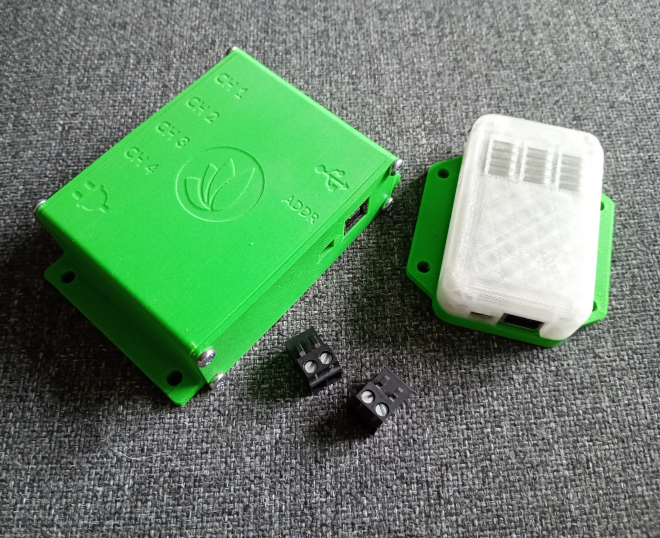

The **Freya Vivarium Control System Legacy Hardware** consists of microcontroller-based modules that connect to the system via USB.

#### Freya Sensor Module
The sensor module includes sensors for measuring temperature (°C), relative light intensity (%) and relative humidity (%)

#### Freya Powerswitch Module
The powerswitch module has four individually controllable power outputs, allowing it to interface with several actuators.

<br clear="right"/>

>[!important]
>These modules played an important role in the development process of Freya, however, this hardware configuration is no longer supported.

## Installation
When installing the Freya Core application, the installer prompts for the Hardware Interface option. So there's no need to install this manually. But should you want to install this component manually, it goes like this:
```
wget -O install.sh https://github.com/Freya-Vivariums/Freya-hardware-legacy/releases/latest/download/install.sh;
chmod +x ./install.sh;
sudo ./install.sh;
```

## License & Collaboration
**Copyright© 2024 Sanne 'SpuQ' Santens**. This project is released under the [**GNU GPLv3**](https://www.gnu.org/licenses/gpl-3.0.en.html) license. However, trademark rules apply to the Freya™ brand.

### Collaboration

If you'd like to contribute to this project, please follow these guidelines:
1. Fork the repository and create your branch from `main`.
2. Make your changes and ensure they adhere to the project's coding style and conventions.
3. Test your changes thoroughly.
4. Ensure your commits are descriptive and well-documented.
5. Open a pull request, describing the changes you've made and the problem or feature they address.